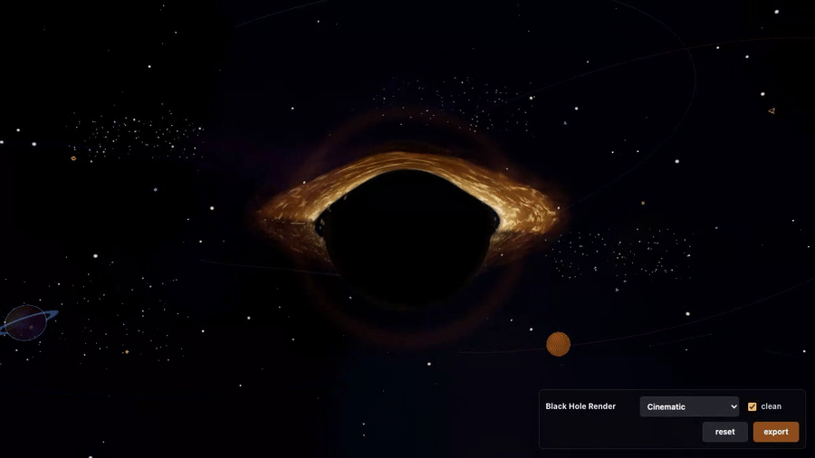
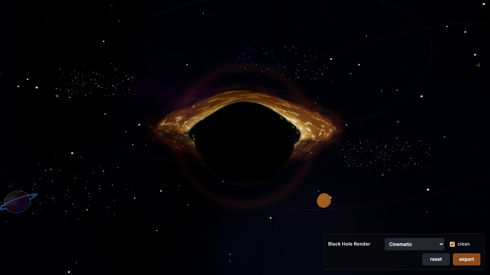
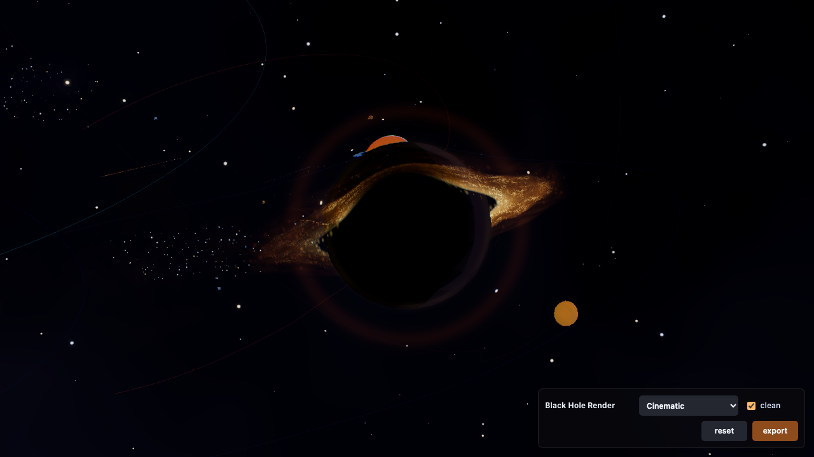

# Black Hole Render



Orbit a luminous accretion disk and explore a black hole through cinematic shader effects.

**[Project page](https://kpetrovski.me/projects/black-hole-render/)** · Run the interactive viewer locally with the commands below.





## How to play

- **Drag** to orbit the camera and **scroll** to zoom.
- Choose **Minimal**, **Cinematic**, or **High Energy**.
- Toggle **Clean** to disable the pixel/posterization pass.
- **Reset** restores framing; **Export** saves a PNG.

The capture uses the Cinematic preset. This is an artistic real-time visualization, not a scientific ray-tracing claim.

## Development

JavaScript, Three.js, GLSL, Vite.

```sh
bun install
bun run dev
```

[Development, verification, and deployment notes](DEVELOPMENT.md).
